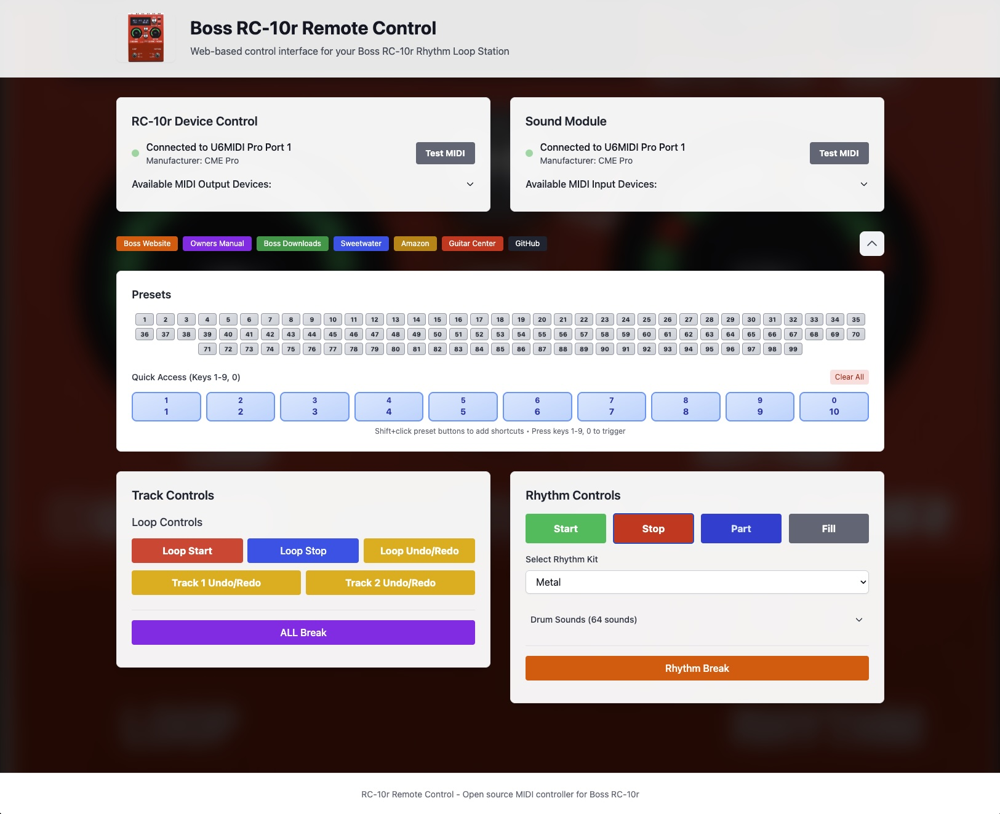

# Boss RC-10r Remote Control

A modern web-based remote control interface for the Boss RC-10r Rhythm Loop Station, built with TypeScript, React, and the Web MIDI API.

## 🎵 Features

- **Real-time Control**: Direct MIDI communication with your RC-10r via USB or MIDI
- **Track Management**: Record, play, and undo individual tracks
- **Rhythm Control**: Start/stop rhythm patterns and change rhythm types
- **Browser-based**: No software installation required

## 🌐 Browser Compatibility

This application requires a modern browser with Web MIDI API support

## 🚀 Quick Start

### Online Version

Visit [https://higginsrob.github.io/rc-10remote/](https://higginsrob.github.io/rc-10remote/) to use the application directly in your browser.

## 🎛️ RC-10r Setup

1. **Connect your RC-10r** to your computer via USB
2. **Power on** the RC-10r
3. **Open the web application** in a supported browser
4. **Allow MIDI access** when prompted by the browser
5. **Select Device Control and Sound Module devices** - the app will automatically detect your RC-10r when connected to USB
6. **Use Presets to load presets from RC-10r device** - these are the 1-99 patches on the device 
7. **Use Track Controls to control looping**
8. **Use Rhythm Controls to control drum loop and kit sounds**

## 📝 License

This project is licensed under the MIT License - see the [LICENSE](LICENSE) file for details.

## 🙏 Acknowledgments

- **Boss Corporation** for creating the RC-10r Rhythm Loop Station
- **Web MIDI API** specification and browser implementations
- **React** and **Redux Toolkit** communities
- **TypeScript** for making JavaScript development enjoyable

## 📞 Support

If you encounter issues:

1. Check that your browser supports Web MIDI API
2. Ensure your RC-10r is connected via USB and powered on
3. Try refreshing the page and allowing MIDI access again
4. Check the browser console for error messages

For bugs and feature requests, please [open an issue](https://github.com/higginsrob/RC-10remote/issues) on GitHub.
